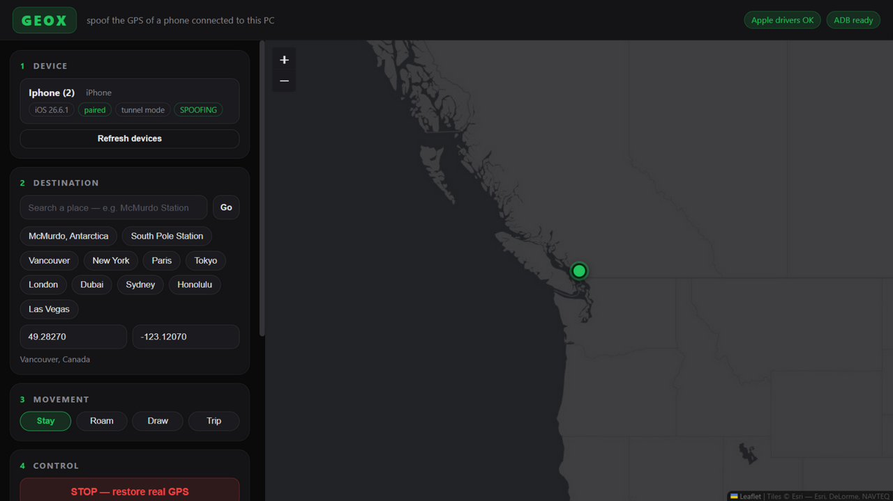

# Geox

**Change the GPS location of a phone connected to your PC, and every app on it believes it.**
Plug an iPhone or Android into the computer with a USB cable, pick any spot on a map, and the phone reports that location at operating-system level.

[](LICENSE)


Plug an iPhone or Android into the computer with a USB cable, pick any spot on a map, and the phone reports that location at operating-system level: Find My, Snap Map, Google Maps, WhatsApp live location, everything.

You are in Vancouver. Everyone checking your location sees you at McMurdo Station, Antarctica.



## Features

- **Map picker.** Search any place, click the map, drag the pin, or use presets (McMurdo and the South Pole included). Dark UI, no clutter.
- **Trip mode.** The location follows a real itinerary: car, bike, or walking routes on actual streets, at realistic speed, arriving and parking at the destination. Can parse a pasted **Google Maps link** (route links, pinned places, `@lat,lng` views).
- **Roam mode.** Drifts between random points inside a radius at walking speed, so your pin looks alive instead of frozen.
- **Draw mode.** Click waypoints on the map and travel between them at a speed you choose.
- **iPhone, iOS 15 through current.** Uses Apple's own Instruments location-simulation channel (the mechanism Xcode uses), including the iOS 17+ tunnel. Nothing is installed on the phone.
- **Android.** Official mock-location provider via a tiny companion app, driven over ADB.
- **Self-installing.** `run_geox.bat` needs no Python and no admin rights: the first run downloads everything automatically. Zip the folder and share it as-is.
- **Self-healing sessions.** The fake fix is re-asserted every second, tunnel blips auto-reconnect, and a phone that drops off USB is waited for and resumed.

## Quick start

### Option A: Web UI
```
1. Double-click  run_geox.bat          (or run ./run_geox.sh)
2. Pick "Web UI" in the launcher menu (arrow keys + Enter)
3. The browser opens http://127.0.0.1:7876
3. Plug the phone in with USB, unlock it, accept the trust prompt
4. Refresh devices → select your phone
5. Pick a destination, choose a movement mode, press START SPOOFING
```

### Option B: Command Line (CLI)
You can run Geox directly from your terminal or command prompt (`cmd.exe`, PowerShell, or bash):

```bat
# Spoof location with a Google Maps URL (Stay mode):
geox --location "https://www.google.com/maps/place/Toronto,+ON/@43.7164673,-79.6563003,..." --movement stay

# Spoof location with Roam mode (radius 120m, speed 4.5 km/h):
geox --location "Toronto, ON" --movement roam 120 4.5

# Spoof directly using presets:
geox --preset mcmurdo --movement roam 200 5

# Plan and drive a realistic trip:
geox --from "Vancouver" --to "Seattle" --profile car --speed-factor 1.5

# Device management and controls:
geox --devices          # List connected phones
geox --stop             # Stop spoofing & restore real GPS
geox --status           # Check active spoofing sessions
geox server             # Start the browser UI
```

The terminal window is the live connection to the phone, so keep it open.
Pressing **Ctrl+C** (or the red **STOP** button in Web UI) restores the real GPS instantly.

### If Windows blocks the file

That's Windows SmartScreen reacting to the "downloaded from the internet" marker, not a virus. Two ways past it:

- **Before extracting**: right-click the downloaded zip, choose **Properties**, tick **Unblock**, then extract. Nothing gets blocked afterwards.
- **On first run**: when the blue "Windows protected your PC" screen appears, click **More info**, then **Run anyway**.

The `run_geox.sh` file is only for macOS, Linux and Git Bash users. Windows users never need it, and double-clicking it on Windows does nothing, which is normal.

## Requirements

| Platform | Needed once |
|---|---|
| **iPhone** | Apple's USB drivers (the *Apple Devices* app from the Microsoft Store, or iTunes; Geox starts the service for you), *Trust this computer*, Developer Mode ON (Geox reveals the switch and walks you through it). And VS community/professional/insider with the C++ module |
| **Android** | USB debugging enabled; build the `Geox Bridge` app once from [`android-bridge/`](android-bridge) (about 10 minutes with Android Studio), then press *Setup bridge* and Geox installs and configures it by itself |

## How it works

On **iPhone**, Geox opens Apple's hidden developer channel for location simulation over the USB pairing. The OS then reports the simulated fix as if it were real GPS, which is why Find My and Snap Map show the fake place: they ask the OS where the device is, and the OS answers with the spoof.

On **Android**, the Geox Bridge companion app receives coordinates over ADB and feeds them into the OS as mock GPS fixes.

**Trip mode** queries OpenStreetMap routers (free, no API key) for real road geometry, then travels the route at the route's real average speed.

The long version (architecture, setup walkthroughs, what can still give you away, troubleshooting, FAQ) is in **[EXPLANATION.md](EXPLANATION.md)**.

## Documentation

- [EXPLANATION.md](EXPLANATION.md): everything about setup, internals, realism tips, troubleshooting and the FAQ
- [android-bridge/README.md](android-bridge/README.md): building the Android companion app

## Disclaimer

Geox changes the location of **your own device**. It does not access, hack, or monitor anyone else. Location spoofing is legal in most places, but how you use it may not be. Faking attendance, cheating delivery or ride apps, or deceiving people whose safety depends on your location can be fraud, a terms-of-service violation, or worse. Provided as-is, for personal and lawful use. You are responsible for what you do with it.

## License

Geox is free to use, modify, and redistribute, **but not to sell**. It's licensed under MIT with a Commons Clause addendum: anyone may use it, change it, and share it for free, but nobody may sell the software itself or charge for it. Donations and free distribution are fine. See [LICENSE](LICENSE).
